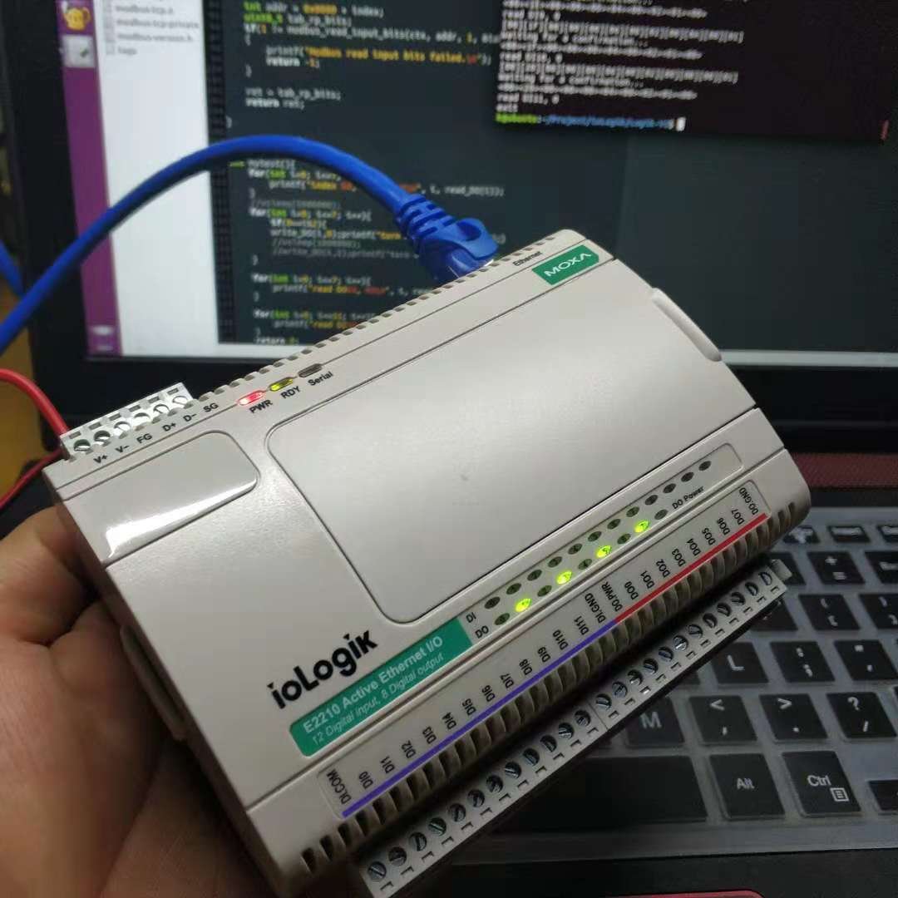

    <h1>
    	ioLogic
    </h1>
	

## About
基于C语言的iologic硬件模块I/O控制，硬件模块用户手册见Manuals，参数修改工具见Tools.

## 关于代码
1.iologik默认ip为192.168.127.254，端口为502，
	open_modbus_tcp_powermang用于建立连接，
	close_modbus_tcp_powermang用于断开连接。
2.函数int read_DO(int index)用于读取DO状态，
	如：read_DO(1)读取DO1的状态(0或1)，index取值0~7
3.函数int write_DO(int index, int status)用于写DO状态，
	如：write_DO(1,0)将DO1置为0；write_DO(1,1)将DO1置为1，index取值0~7，status取0或1
4.函数int read_DI(int index)用于读取DI状态，
	如：read_DI(1)读取DO1的状态(0或1)，index取值0~11
5.函数mytest()用于测试，不用管
6.makefile中用GCC编译，若在arm上运行，改为用arm-linux交叉编译

## 注意事项
1.iologik设置了访问权限，读取DI/DO状态必须通过ioAdmin工具进行设置，否则没有权限
	具体操作：将板卡ip添加到Network->ip setting->Accessible ip列表中并保存
2.操作ioAdmin若无法搜索到设备,注意网卡接口选择后重新搜索，见说明书或Manuals文件夹
3.ioLogik恢复出厂后原配置清空，配置好ip后可以导出配置文件并保存
